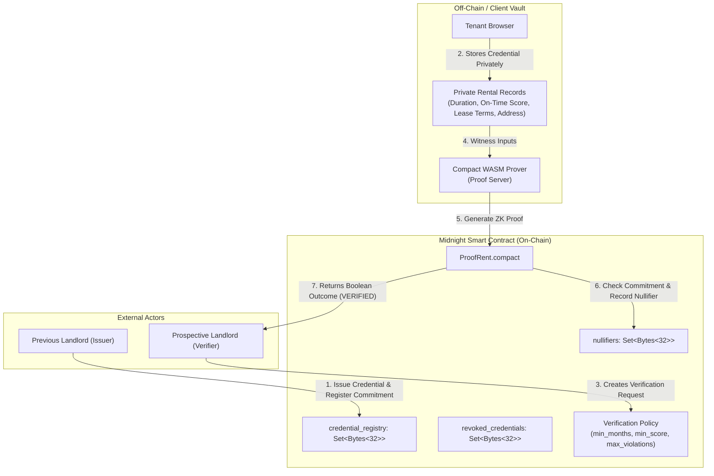

# ProofRent System Architecture

ProofRent is a privacy-first rental reputation and verification decentralized application built on the **Midnight Network**. This document details the technical architecture, component interactions, cryptographic flows, and network boundaries.

---

## 1. High-Level Architecture Overview

ProofRent decouples rental credibility from personal data exposure using Zero-Knowledge SNARKs and Midnight's data-protection blockchain:

---

## 2. Core Components

### 2.1 Compact Smart Contract (`contracts/proofrent.compact`)
The core on-chain state machine running on the Midnight blockchain. It enforces:
- **`credential_registry`**: Set of 32-byte cryptographic hashes representing validly issued credentials.
- **`revoked_credentials`**: Set of invalidated commitments, preventing revoked credentials from being used.
- **`nullifiers`**: Cryptographic nonces derived from the tenant's secret identity and the credential commitment, ensuring a credential cannot be double-spent or replayed within a single application scope.
- **Policy Thresholds**: `min_tenancy_months`, `min_payment_score`, `max_violations`, and `deadline`.

### 2.2 Client-Side Execution Engine (Frontend)
- **Compact WASM Runtime**: Evaluates private witness circuits directly inside the user's browser without sending unencrypted credentials to any centralized server.
- **Proof Provider (`@midnight-ntwrk/midnight-js-http-client-proof-provider` / Proof Server)**: Generates the cryptographic zero-knowledge arguments (~180ms - 2s).
- **Patched Public Data Provider (`createPatchedPublicDataProvider`)**: Queries contract state from the Midnight GraphQL Indexer, avoiding the Preprod `offset: null` bug.
- **Wallet Provider**: Interacts with the browser extension (1AM, Lace, or Nightly) to sign and balance transactions with DUST fee tokens.

### 2.3 Midnight Network Infrastructure
- **Midnight Node RPC (`https://rpc.preprod.midnight.network`)**: Submits balanced and signed proof transactions to consensus.
- **Midnight Indexer (`https://indexer.preprod.midnight.network/api/v4/graphql`)**: Indexes block state changes and makes public ledger variables searchable.
- **Midnight Explorer (`https://preprod.midnightexplorer.com`)**: Provides verifiable on-chain proof of contract deployment and transaction finality.

---

## 3. Data Flow Comparison

| Dimension | Traditional Web2 Verification | ProofRent on Midnight |
|---|---|---|
| **Address Privacy** | Disclosed to all screeners | **100% Shielded** (Evaluated as private witness) |
| **Rent Amount** | Disclosed on paystubs & leases | **100% Shielded** (Only threshold is verified) |
| **Document Storage** | Stored on property manager cloud | **Stored locally** in tenant's client vault |
| **Authenticity** | Manual phone calls & paper letters | **Cryptographic Commitment** on Midnight ledger |
| **Replay Protection** | None (PDFs can be forged) | **Deterministic Nullifiers** on-chain |
| **Verification Speed** | 3 to 7 business days | **Near Instantaneous** (Zero-Knowledge proof) |
